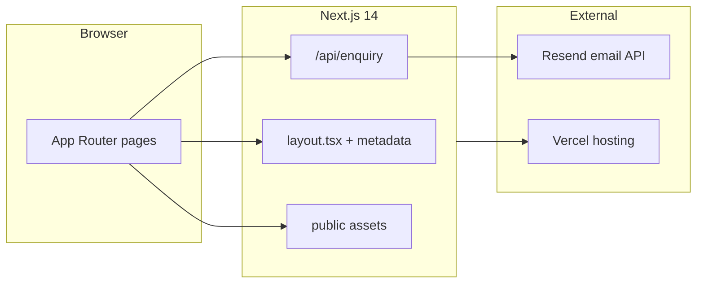

# Excel Trade International Ltd (ETIL)

Marketing website for **Excel Trade International Ltd** — a UK-based engineering supply company serving West Africa across industrial, petrochemical, mining, domestic, and hospitality sectors.

**Live site:** [hostinger-etil.vercel.app](https://hostinger-etil.vercel.app)

Built with **Next.js 14 App Router**, **React 18**, and **TypeScript**. Replaces a legacy static HTML site with a maintainable, SEO-ready Next.js application.

## Tech stack

| Layer | Technology |
| --- | --- |
| Framework | Next.js 14 (App Router) |
| UI | React 18, TypeScript, CSS Modules / globals |
| Images | `next/image` for banners and product cards |
| Contact | Resend API via `/api/enquiry` |
| SEO | Per-page metadata, Open Graph, Twitter cards, sitemap, robots, web manifest, Organization JSON-LD |
| Hosting | [Vercel](https://hostinger-etil.vercel.app) |

## Architecture



**Request flow:** visitors load App Router pages rendered with shared layout, header, and footer. The contact form POSTs to `/api/enquiry`, which validates input, checks a honeypot field, and sends email through Resend when configured.

## Project structure

```
app/
  page.tsx              Home
  about/                About ETIL
  services/             Industrial supply (pumps, valves, motors, automation)
  general/              General supplies
  vehicles/             Vehicle supply
  team/                 Team page
  contact/              Contact form
  privacy/              Privacy policy
pages/api/              Contact form and vehicles API routes
  sitemap.ts            Dynamic sitemap
  robots.ts             Robots.txt
  manifest.ts           Web app manifest
components/             Header, Footer, shared UI
lib/siteData.ts         Navigation links, overview cards, site copy
public/                 Banners, logos, product imagery
```

Site copy and navigation are centralized in `lib/siteData.ts` so content updates do not require hunting through scattered HTML files.

## Screenshots

| Home | About |
| --- | --- |
|  |  |

**ETIL emblem** — used in header, favicon, and Organization schema:


## Quick start

```bash
git clone https://github.com/kaybee77/hostinger-etil.git
cd hostinger-etil
npm install
npm run dev
```

Open [http://localhost:3000](http://localhost:3000).

### Scripts

| Command | Description |
| --- | --- |
| `npm run dev` | Start the Next.js development server |
| `npm run build` | Production build |
| `npm run start` | Serve the production build locally |

## Environment variables

Copy [`.env.example`](.env.example) to `.env.local` for local development:

```bash
cp .env.example .env.local
```

| Variable | Required | Description |
| --- | --- | --- |
| `RESEND_API_KEY` | Yes (production) | Resend API key for the contact form |
| `CONTACT_TO_EMAIL` | Optional | Inbox for submissions (default: `info@exceltradeint.com`) |
| `CONTACT_FROM_EMAIL` | Optional | Sender address (use a verified `@exceltradeint.com` address in production) |

See **[docs/CONTACT_FORM_SETUP.md](docs/CONTACT_FORM_SETUP.md)** for Resend account setup, domain verification, and Hostinger configuration.

## Design choices

- **Next.js App Router over static HTML** — enables per-route metadata, dynamic sitemap/robots, API routes, and a single codebase that is easier to extend.
- **Centralized content in `lib/siteData.ts`** — navigation, overview cards, and reusable copy live in one module instead of duplicated across legacy HTML pages.
- **`next/image` for all banners and product cards** — automatic optimization and responsive sizing for page-top banners and service imagery.
- **SEO-first metadata** — root layout defines Open Graph, Twitter cards, canonical URLs, and Organization JSON-LD (company no. 15474851).
- **Contact form with honeypot** — hidden `website` field catches bots; invalid submissions fail gracefully with user-facing error messages when Resend is not configured.
- **Mobile navigation** — hamburger menu with active-link highlighting for smaller viewports.

## Deployment

**Production** is hosted on **Hostinger Business** (Node.js Web Apps) at [https://www.exceltradeint.com](https://www.exceltradeint.com).

The app is connected to GitHub (`kaybee77/hostinger-etil`, `master` branch). Every push to `master` triggers an automatic Hostinger build and deploy.

| Setting | Value |
| --- | --- |
| Install command | `npm ci` |
| Build command | `npm run build` |
| Start command | `npm run start -- -p $PORT` |
| Node.js version | 20.x |
| Output directory | `.next` |

**Staging** remains available on [hostinger-etil.vercel.app](https://hostinger-etil.vercel.app).

Set `RESEND_API_KEY`, `CONTACT_TO_EMAIL`, and `CONTACT_FROM_EMAIL` in the Hostinger Node.js dashboard before enabling the contact form in production.

## License

Private client project. All rights reserved by Excel Trade International Ltd.
